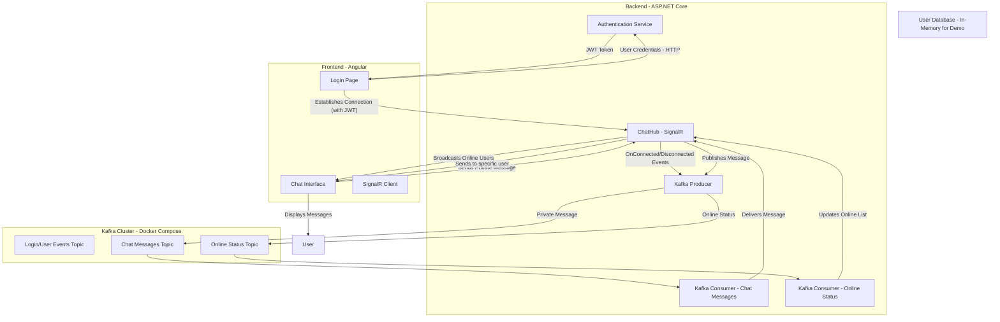

# Real-time Chat Application with Kafka, SignalR & Angular

## 🚀 Project Overview

This is a personal study project demonstrating a real-time chat application built using **Apache Kafka** for reliable message streaming, **ASP.NET Core SignalR** for real-time web communication, and **Angular** for the frontend user interface.

The application allows users to log in, see a list of online users, and send private messages to other connected users. Online status updates are handled in real-time.

## ✨ Features

  * **User Authentication:** Secure login using JWT (JSON Web Tokens).
  * **Real-time Online Status:** See which registered users are currently online.
  * **Private Messaging:** Send and receive instant messages between authenticated users.
  * **Kafka-backed Messaging:** All messages and status updates flow through Kafka, ensuring high throughput, reliability, and scalability.
  * **SignalR Communication:** Efficient real-time push notifications from the backend to connected clients.
  * **Responsive Angular Frontend:** User-friendly interface to manage chats and view online users.

## 🏗️ Architecture

The project follows an event-driven, microservices-inspired architecture:



## 🛠️ Technologies Used

  * **Backend:** ASP.NET Core 8.0
      * **SignalR:** Real-time web functionality.
      * **Confluent.Kafka:** .NET client for Apache Kafka.
      * **JWT Bearer Authentication:** Secure API and SignalR connections.
  * **Frontend:** Angular 17+
      * **@microsoft/signalr:** SignalR JavaScript client.
      * **HttpClient:** For API communication (login).
  * **Message Broker:** Apache Kafka (with Zookeeper)
      * Managed locally via Docker Compose.
  * **Containerization:** Docker / Docker Compose

## 🚀 Getting Started

Follow these steps to get the project up and running on your local machine.

### Prerequisites

  * [.NET 8.0 SDK](https://dotnet.microsoft.com/download/dotnet/8.0)
  * [Node.js](https://nodejs.org/en/download/) (LTS recommended)
  * [Angular CLI](https://angular.io/cli) (`npm install -g @angular/cli`)
  * [Docker Desktop](https://www.docker.com/products/docker-desktop/) (for Kafka)

### 1\. Start Kafka (using Docker Compose)

Navigate to the project root directory (where your `docker-compose.yml` file is located) and run:

```bash
docker-compose up -d
```

This will spin up Kafka and Zookeeper. It might take a moment to download images and start the services.

**Verify Kafka Topics (Optional):**
While Kafka is running, you can create the necessary topics manually, though the backend will attempt to create them on first use.

```bash
docker exec broker kafka-topics --create --topic chat-messages --bootstrap-server broker:29092 --replication-factor 1 --partitions 1
docker exec broker kafka-topics --create --topic online-status --bootstrap-server broker:29092 --replication-factor 1 --partitions 1
```

### 2\. Run the ASP.NET Core Backend

1.  Open a new terminal and navigate to the `RealtimeAppBackend` directory:

    ```bash
    cd RealtimeAppBackend
    ```

2.  Restore NuGet packages:

    ```bash
    dotnet restore
    ```

3.  Run the application:

    ```bash
    dotnet run
    ```

    The backend API and SignalR Hub should start, typically on `http://localhost:5000`. The Kafka consumer will also start listening for messages.

### 3\. Run the Angular Frontend

1.  Open another new terminal and navigate to the `RealtimeAppFrontend` directory:

    ```bash
    cd RealtimeAppFrontend
    ```

2.  Install npm dependencies:

    ```bash
    npm install
    ```

3.  Start the Angular development server:

    ```bash
    ng serve --open
    ```

    This will open your browser to `http://localhost:4200` (or another port if 4200 is in use).

### 4\. Testing the Application

To test simultaneous users (e.g., Alice and Bob):

  * Use **different web browsers** (e.g., Chrome for Alice, Firefox for Bob, Edge for Charlie).
  * Alternatively, use **separate Incognito/Private windows**. Ensure each Incognito window is opened independently (not by duplicating tabs from an existing Incognito window) to guarantee distinct session storage.

**Default Users (in-memory):**

  * **alice** / password\_hashed\_alice (password is just a string match in demo, replace with real hashing\!)
  * **bob** / password\_hashed\_bob
  * **charlie** / password\_hashed\_charlie

Login with each user in a separate browser/incognito window. You should see them appear in each other's "Online Users" list and be able to send private messages.

## 💡 Learning & Future Enhancements

This project served as a valuable learning experience. Here are some areas for future enhancements:

  * **Database Persistence:** Replace the in-memory `UserRepository` with a real database (e.g., PostgreSQL with Entity Framework Core) for users and chat message history.
  * **Secure Password Hashing:** Implement robust password hashing (e.g., BCrypt) for user credentials.
  * **Group Chat Functionality:** Extend the chat to support group conversations.
  * **Read Receipts/Typing Indicators:** Add features like "seen" statuses or "typing..." notifications.
  * **Error Handling & Logging:** Improve error handling and implement comprehensive logging across all components.
  * **Scalability for SignalR:** Integrate with Azure SignalR Service or a Redis Backplane for scaling SignalR across multiple backend instances.
  * **Dockerize Everything:** Create a unified `docker-compose.yml` to run the entire application stack (Kafka, Backend, Frontend) with a single command.
  * **Frontend UI Improvements:** Enhance the chat interface with features like scroll to bottom, timestamps, and better styling.

Feel free to fork this repository, explore the code, and contribute\!
